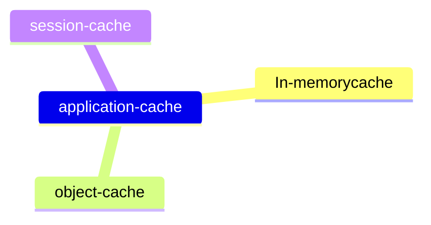

# Application caching

Involves storing of the memory within or close to application itself, The goal is to minimize the latency and load on backend systems

## Types of application caches

### In-memory-cache

_stores frequently used data in RAM_ for fast access

1. In-Memory Cache: stores frequently used data in **RAM**.

   - Libraries used:
     - Redis(key-value store with TTL, pub/sub)
     - Memcached: light weight key value store

2. Object cache: frequently used objects or data structures stored inside using programming frameworks.

3. Session Cache: stores user session data to reduce database lookups
   - Libraries used:
     - Redis
     - sticky sessions
