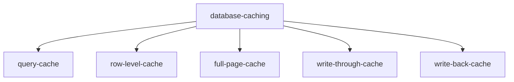

# Database caching

## Def

keeping copies of database query results, rows or colums or objects in cache

## Types of Database caches

### Query-cache

- stores the result of expensive database queries,

### RowLevel

- caching individual database row in memory

### Full page cache

- stores entire database-generated file for faster retrieval

### Write-through cache

- write the data to cache and database at the same time, ensure consistency but add write latency

### Write-back Cache

- writes data back to cache first, then asynchronously updates the database. Improves with performance but risks the data losses.
