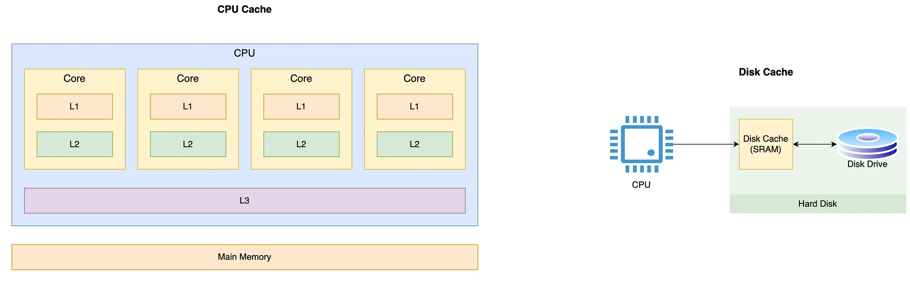

# Hardware level caching

- specialized memory units(SRAM - static RAM) integrated to hardware components.
- stores copies of data that system will predicts it will be needed soon
- it is also about minimizing latency between and maximizing through put

## CPU cache

- stores frequently accessed instruction in L1, L2, L3 caches.

## Disk cache

- stores frequently accessed disk in data in RAM

