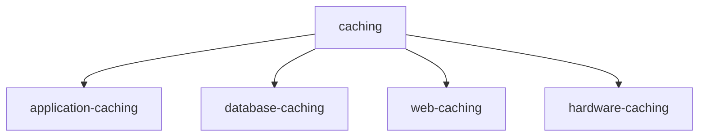

# Caching

## General overview of caching

- critical technique for improving speed and performance in modern computing
- main activity is storing the frequently accessed data close to computer
- different caching strategies also exists

### what is a cache?

Hardware or software comonnet that stores data of frequent accessed requests

### Types of caching

