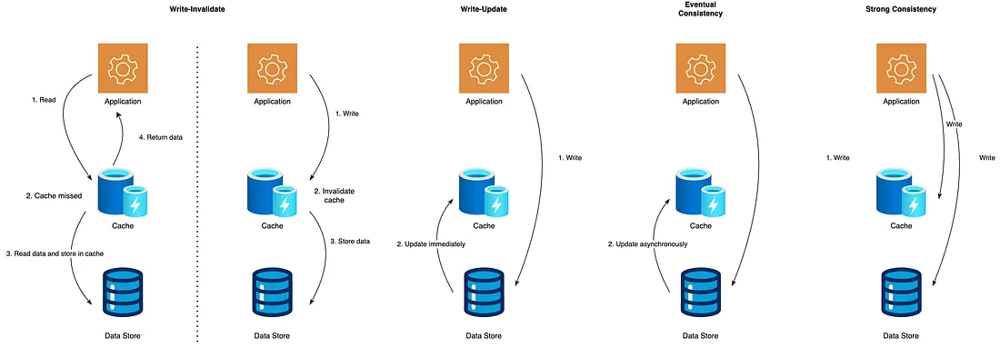
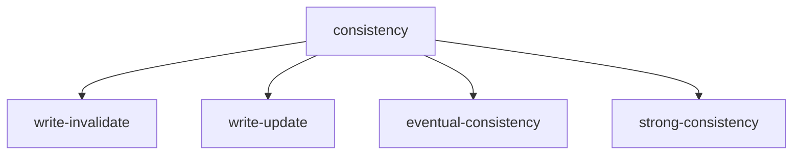

# Cache consistency

how cache stays in sync with source

## write invalidate

when data is updated in source, invalidate the corresponding data in cache

- Pros:
  - enforce fresh data on next access
- Cons:
  - next read causes a miss
- Usecases:
  - distributed caches(invalidate redis key on db update)

## write update

update the cache immediately when the source is updated

- Pros:
  - caches is fresh and no misses after the update
- Cons:
  - multi -core cpu cache coherence

## Eventual consistency

strategy where the data in cache and the data in source many not immediately updated, but they will be consistent over time

- Pros:
  - scales well and tolerates delay
- Cons:
  - Temporary staleness
- Usecases:
  - distributed systems like cdn

## strong consistency

the source and cache are always consistent

- Pros:
  - No stale data
- Cons:
  - slower, less scalable
- Usecases:
  - critical systems and financial systems
