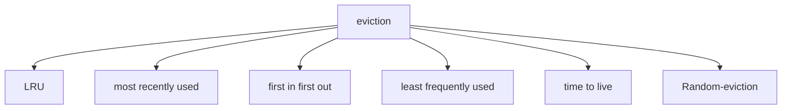
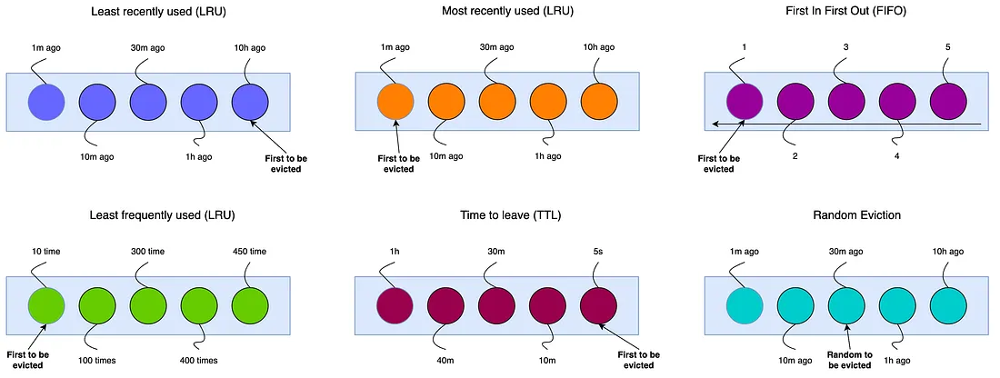

# Cache eviction strategies

decides what data to remove when cache is full

## LRU (Least recently used)

Evict least recently used cache

- Pros:
  - Good for work load with temporary localit
- Cons:
  - overhead to track usage
- Usecase:
  - recently used items are likely to be used again

## Most recently used

Exit most recently used item

- Pro:
  - useful when recent data is least likely to be reused
- Con:
  - Rare in practice
- Usecase:
  - when recent data is less likely to be used when after the accessing

## Least frequently used (LFU)

evict least frequently accessed item

- Pros:
  - prioritizes the heavily used data
- Cons:
  - needs frequency tracking and adoption is slow
- Usecase:
  - web caches with staable access points

## First In and First out

Evict old item regarless of usage

- Pros:
  - simple to implement
- Cons:
  - ignores the access patterns
- Usecases:
  - basic queues or hardware buffers

## Time to live

Data expires after some time irrespective of usage

- Pros:
  - Predictable expiration
  - prevent staleness
- Cons:
  - may evict useful data too soon
- Usecase:
  - redis with expiration
  - web caching
- when to use:
  - when you want data to be expired without any restrication after certain time
