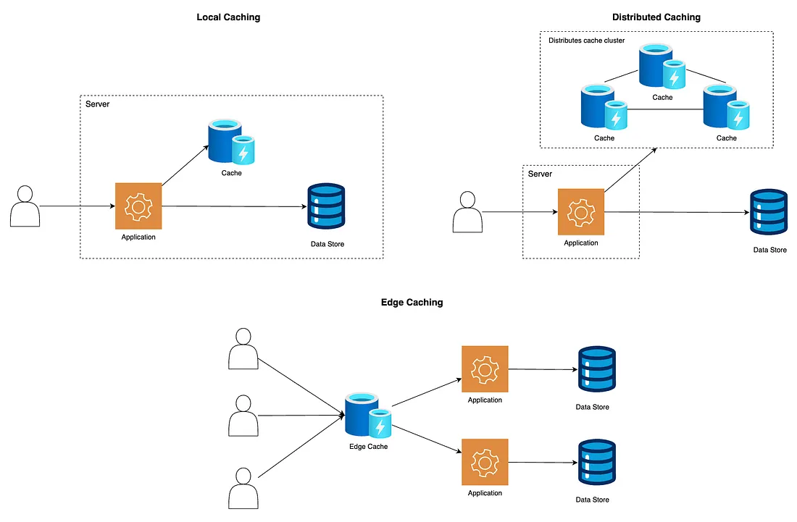

# cache placement strategy

determines where cache lives



````mermaid
graph TD
    placement --> local-caching
    placement --> edge-caching
    placement --> distributed-caching
```

## Local-caching

caching on the same machine or same running process

- Pros:
  - fast access, no network
- Cons:
  - limited size and no sharing
- Usecases:
  - cpu caches
  - app-level in memory

## Distributed Cache

cache spans multiple nodes in a cluster

- Pros:
  - Scalable, shared across the apps
- Cons:
  - Network latency and complex
- Usecase:
  - redis cluster and memchached in microservices

## Edged caching

caching near user

- Pros:
  - reduce latency for end user
- Cons:
  - Hard to invalidate globally
- Usecase:
  - webcaching with cloudflare
````
