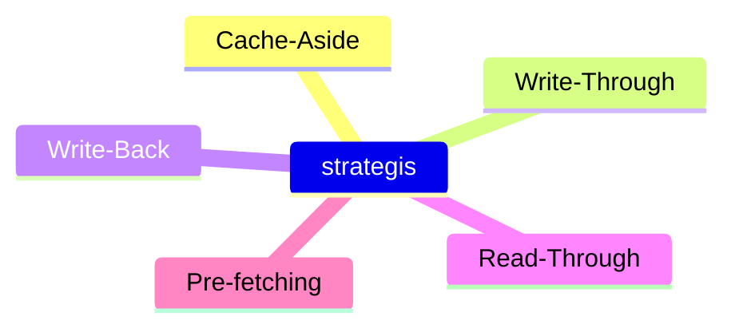
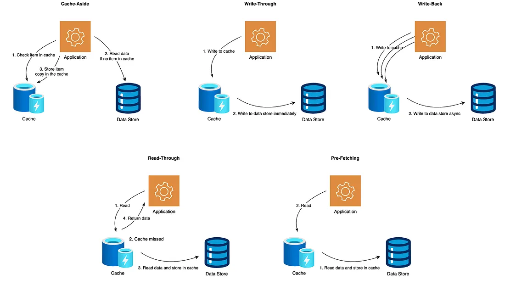

# Caching strategies

- These strategies determine when and how data gets into cache

## Cache-Aside

The application checks the cache first, on miss it fetches data from source and manually stores the data to cache.

- Pros:
  - simple and app controls what to cache
- Cons:
  - risk of state, slow down of requests
- Ex:
  - app level caching with redis

## Write-through

The data is stored to both cache and datastore simultaneously

- Pros:
  - cache states updated without staleness
- Cons:
  - slower writes due to dual updates
- Ex:
  - hardware caching or system requiring strong consistency.

## Write-Back

The data is stored first in cache and later added to backend store asynchronously

- Pros
  - Faster writes and reduce load on the store
- Cons:
  - Risk of data lose if fails before sync
- Ex:
  - disk controllers, distributed cache with eventual consistency

## Read Through

The cache itself fetches data first if on a miss, transparently to app

- Pro:
  - simplifies add logic
  - cache the handles loading
- Cons:
  - tighter coupling between cache and source
- Ex:
  - some orms or caching libraries

## Prefetching strategies

predictively loading data to cache based on pattern or locality befor even requestd

- Pro:
  - Reduce misses and fast access
- Cosn:
  - space wastage if predictions are wrong
- Usecases:
  - CPU caches and CDN preloading assets
